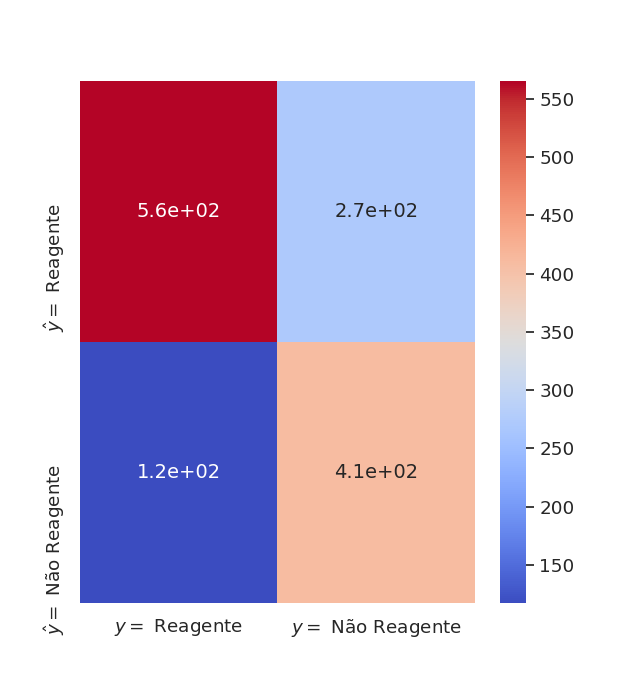
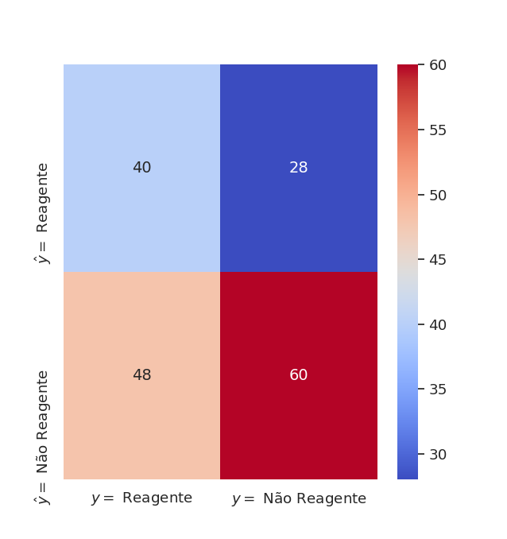
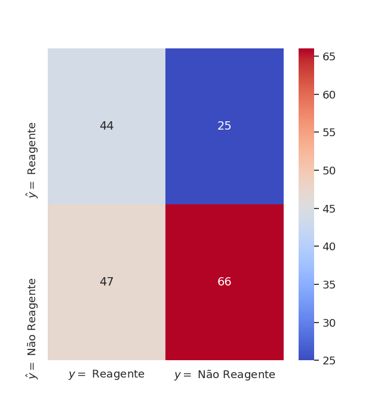

# :bar_chart: COVID-19 prediction

[](https://github.com/Naereen/StrapDown.js/blob/master/LICENSE)


This project aims to predict the result of three kinds of exams that detects the viral disease [COVID-19](https://pt.wikipedia.org/wiki/COVID-19): [PCR](https://en.wikipedia.org/wiki/Polymerase_chain_reaction), [IgM](https://en.wikipedia.org/wiki/Immunoglobulin_M) and [IgG](https://en.wikipedia.org/wiki/Immunoglobulin_G) tests. 

It trains three feedforward neural networks with data from exams of the [Albert Einstein Israelite Hospital](https://en.wikipedia.org/wiki/Albert_Einstein_Israelite_Hospital), obtained from the COVID-19 Data Sharing/BR, available at [https://repositoriodatasharingfapesp.uspdigital.usp.br/](https://repositoriodatasharingfapesp.uspdigital.usp.br/). The preprocessed data can be found at `data/einstein.out.csv`.

This is a project for the subject MAC0425 (artificial intelligence) at IME-USP. The final report (in Portuguese) can be found [here](doc/report.pdf).

## Instalation

All the packages used can be installed with:

```bash
  pip install -r requirements.txt
```

## Usage
The three models can be trained with:

```bash
  python3 main.py
```

## Results
The models were validated by Cross-Validation with k-folds (k=10). The results are shown below.

### Accuracies from Cross Validation
Repetition | PCR | IgM | IgG
----|-------|-------|------
 1  | 0.644 | 0.568 | 0.639
 2  | 0.715 | 0.542 | 0.604 
 3  | 0.701 | 0.600 | 0.500 
 4  | 0.500 | 0.570 | 0.613 
 5  | 0.738 | 0.653 | 0.670 
 6  | 0.704 | 0.542 | 0.549 
 7  | 0.723 | 0.649 | 0.500 
 8  | 0.682 | 0.640 | 0.678 
 9  | 0.736 | 0.625 | 0.610 
 10 | 0.716 | 0.566 | 0.577

Metric    | PCR   | IgM   | IgG
----------|-------|-------|------
mean      | 0.686 | 0.595 | 0.594 
std. dev. | 0.071 | 0.044 | 0.063
max       | 0.738 | 0.653 | 0.678 
min       | 0.500 | 0.542 | 0.500

### Confusion matrices

#### PCR
  
#### IgM

#### IgG
  

## License
MIT
